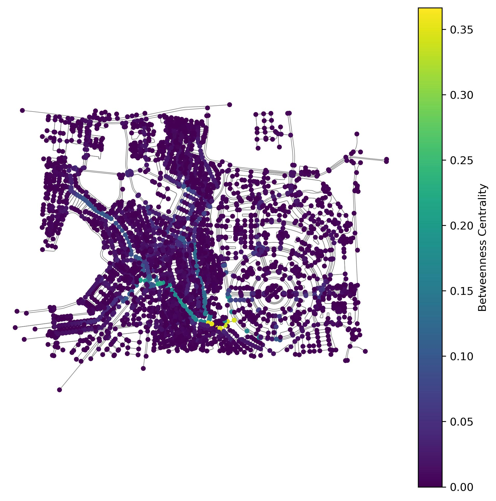

# Urban Compactness and Street Network Analysis — Gardinia City, New Cairo

This project analyzes **urban form** and **street network characteristics** in **Gardinia City, New Cairo** using a combination of Python (Jupyter Notebook) and R for spatial analysis and visualization.\
It focuses on two key metrics:

-   **Urban Compactness** — using nearest neighbor distances between buildings as a proxy.
-   **Street Network Betweenness Centrality** — a graph-theoretic measure of how often a node lies on shortest paths in the network.

------------------------------------------------------------------------

## Overview of Workflow

### **1. Data Preparation (Python)**

Processing building footprints and downloading the street network from OpenStreetMap (OSM) using OSMnx.

#### Steps:

1.  **Load local building data**

    -   Two datasets:
        -   `structured` (planned, grid-like developments)\
        -   `unstructured` (organic, less regular developments)\
    -   Stored as GeoPackage files.

2.  **Reproject to UTM (EPSG:32636)**\
    Ensures measurements (distances) are in meters.

3.  **Calculate Bounding Box**\
    Combines both building datasets and determines the geographic extent.

4.  **Download OSM Street Network**\
    Uses `osmnx` to fetch all street types within the bounding box.

5.  **Reproject Network**\
    Matches building dataset's CRS for spatial alignment.

6.  **Combine Building Layers**\
    Combines both building datasets for later visualization.

7.  **Export Data**

    -   Buildings → not included in public repo for copyright purposes

------------------------------------------------------------------------

### **2. Street Network Analysis**

1.  **Betweenness Centrality**
    -   Calculated with `networkx` using street length as edge weight.
    -   Values indicate the importance of nodes in facilitating movement.
2.  **Visualization**
    -   Base street network map.
    -   Betweenness centrality map with a `viridis` color scale.
    -   Colorbar legend for interpretability.

3.  **Export Data**
    -   Nodes (with betweenness values) → `nodes_with_betweenness.gpkg`
    -   Edges → `cairo_edges.gpkg`

------------------------------------------------------------------------

### **3. Urban Compactness Calculation**

1.  **Centroid Extraction**\
    Computes the centroid of each building footprint.

2.  **Nearest Neighbor Search**

    -   Uses `scipy.spatial.cKDTree` for fast spatial queries.
    -   Finds the distance to the closest other building.
    -   Stores result as `nearest_dist_m` (meters).

3.  **Export Results**

    -   Buildings (with nearest neighbor distance) → not included in public repo for copyright purposes

------------------------------------------------------------------------

### **4. Visualization & Layout (R)**

R is used for plotting and layout composition with **ggplot2** and **patchwork**.

#### Steps:

1.  **Load Data**
    -   Buildings (with type & nearest distance)
    -   Street network edges
    -   Nodes (with betweenness centrality)
2.  **Split by Building Type**
    -   `structured` vs. `unstructured`
3.  **Histogram Plots**
    -   Show distribution of nearest neighbor distances.
    -   Structured and unstructured developments plotted separately.
    -   Color mapping corresponds to distance.
4.  **Map Plot**
    -   Streets: grey lines.
    -   Nodes: colored by betweenness centrality.
    -   Buildings: filled by nearest neighbor distance.
5.  **Final Layout**
    -   Central map showing spatial relationships.
    -   Histograms placed on the sides as a "legend" to show distance distributions.

------------------------------------------------------------------------

## **Visualization**

-   **Description**:
    -  Combined map of buildings + street network + histograms.
    -  Neighbor distance distribution plots for structured vs. unstructured areas.
    -  Betweenness centrality within two neighborhoods of Gardinia City, Cairo.

------------------------------------------------------------------------

## Author

David Voellner

## Data
Map and analysis based on OSM data and local building datasets.

